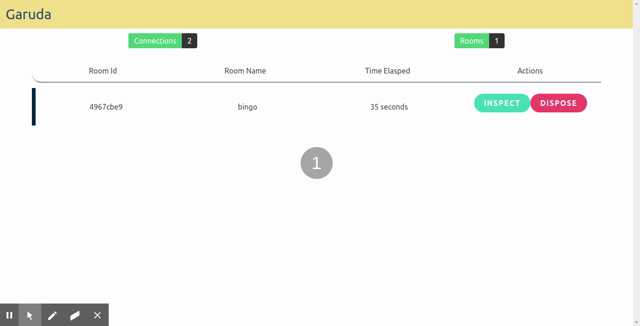

# Garuda

> ### A multiplayer game server framework for phoenix.

> Build and run game servers intuitively.

  


Garuda is an Authoritative Multiplayer Game Server for [Phoenix framework](https://www.phoenixframework.org/)

  

The project focuses on providing a *game framework system*, *matchmaking*, *real-time game-session monitoring system* and ease of usage both on server-side and client-side, by leveraging the powerful phoenix framework.

  

The goal of the framework is to be have a standard framework & matchmaking solution for all type of games. BEAM directly maps the use cases of a typical game server. So Let's build and run game servers, in a much more intuitive way.

### :warning:  This project is in beta.

Current feature list.

- WebSocket-based communication (Will support more transports layer in future, thanks to phoenix)

- Simple API in the server-side and client-side.

- Game specific module behaviours.

- Matchmaking clients into game sessions.

- Realtime interactive game session monitoring.

  
  

### Realtime monitoring



### Client Side Support.

Garuda ships with a javascript client [garudajs](https://github.com/madclaws/garudajs), which allows easy communication with the server (This also leverages [phoenixjs](https://hexdocs.pm/phoenix/js/)).

  

## Installation

```elixir

def  deps  do
  [
    {:garuda, "~> 0.2.3"}
  ]
end

```

## Demo

A multiplayer Bingo game is developed, to showcase the Garuda. [try the game](https://madclaws.github.io/Bingo/)

  
Bingo client [source code](https://github.com/madclaws/Bingo)

Dingo (bingo server, using Garuda) [source code](https://github.com/madclaws/Dingo)

## Documentation

The docs can be found at [https://hexdocs.pm/garuda](https://hexdocs.pm/garuda).

## Collaborators

[ghostdsb](https://github.com/ghostdsb), [Brotchu](https://github.com/Brotchu)
